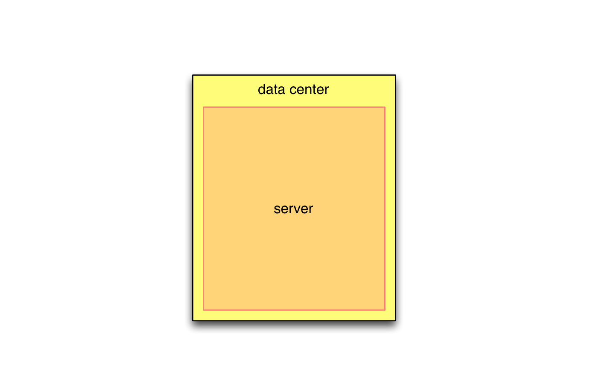
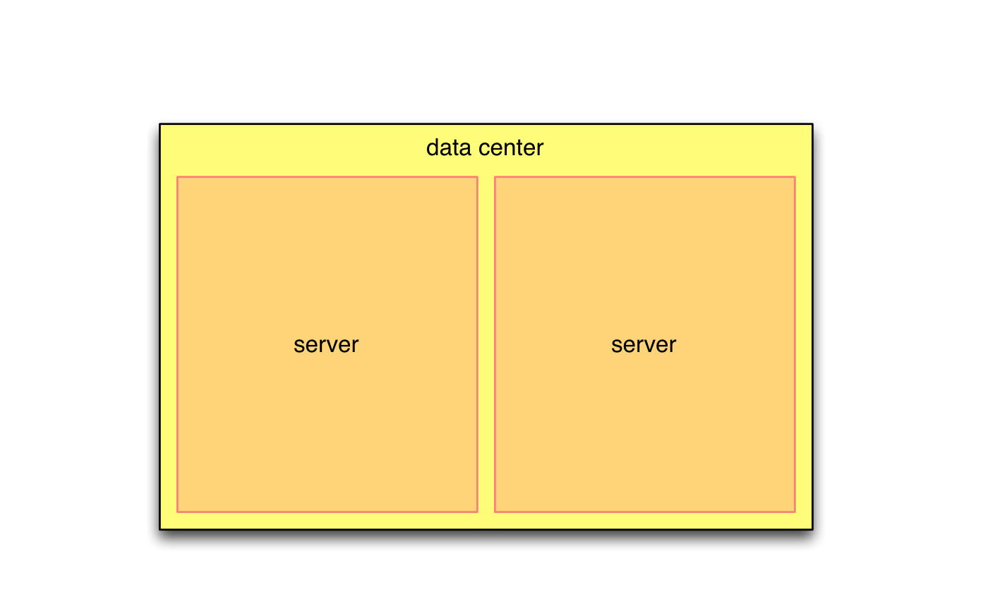
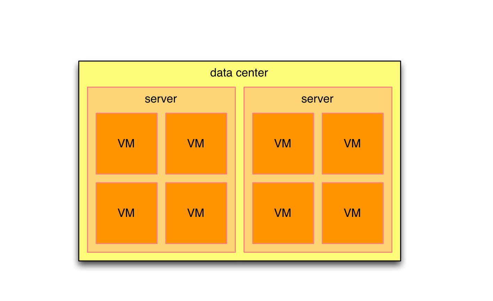
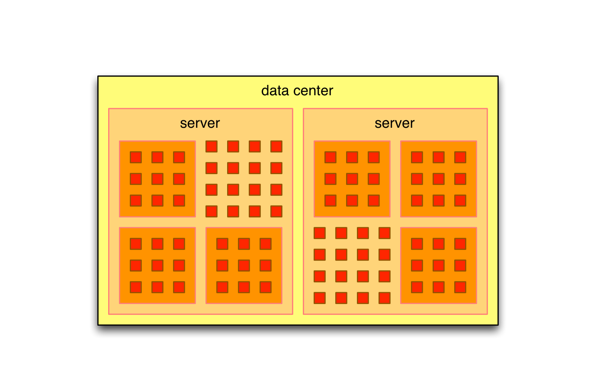
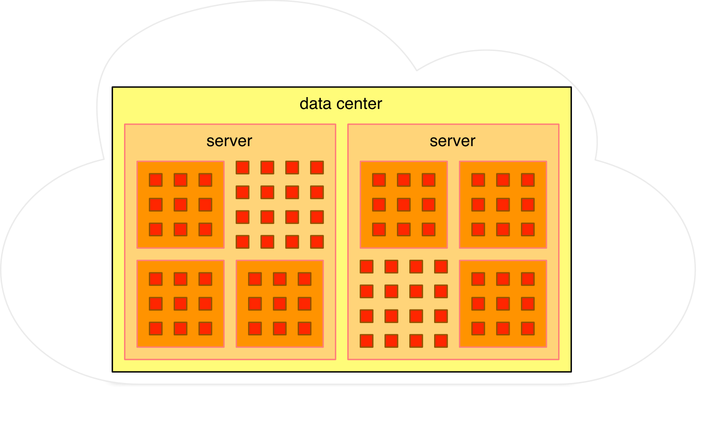
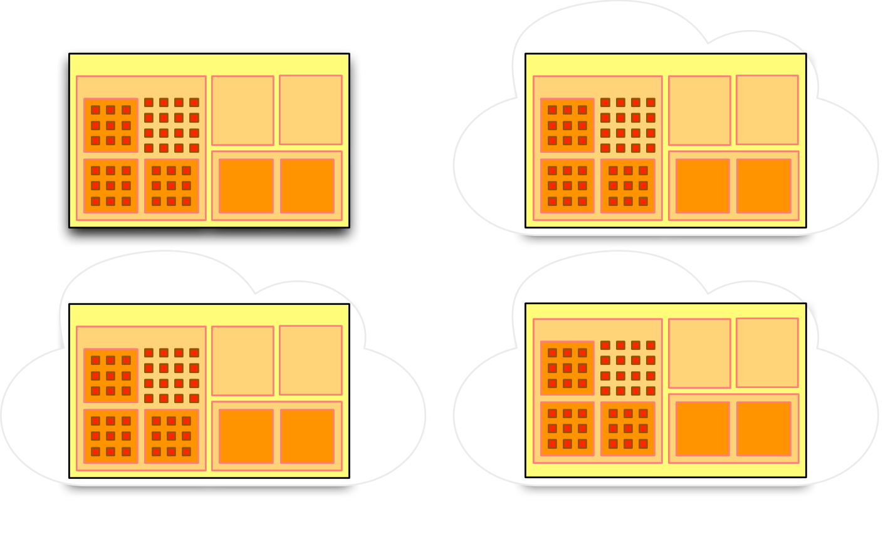

## Automating the modern data center
## Workshop


!SLIDE
# Preparation

!SUB
## You will need

- The workshop repository
- The AWS credentials
- The latest stable version of Terraform

!SUB
## Workshop repository
```
$ git clone https://github.com/cargonauts/workshop-terraform-multi-cloud.git
```

!SUB
## The AWS credentials
Download the zipfile from: 

-- INSERT IP HERE --

!SUB
## Terraform
Download the latest version from [terraform.io](http://www.terraform.io/)

Mac users can also use Homebrew: `brew install terraform`

!SLIDE
# Part 1a: 
## Single instance on Amazon

!SUB


# Cargonauts


A Xebia initiative

All about data center automation:
  - Automate, automate, automate!
  - Code the infrastructure!
  - Containerize all the things!

[cargonauts.io](http://cargonauts.io)

!SUB
# Who are we?

Adé Mochtar - [ade@cargonauts.io](mailto:ade@cargonauts.io)

Benny Cornelissen - [benny@cargonauts.io](mailto:benny@cargonauts.io)


!SLIDE
## What is the
# modern data center?

!SUB
Data centers have drasticly evolved past decade

!SUB
## Single server
<!-- .element: class="dc" -->

!SUB
## Multiple servers
<!-- .element: class="dc" -->

!SUB
## Virtualization
<!-- .element: class="dc" -->

!SUB
## Containerization
<!-- .element: class="dc" -->

!SUB
## Cloud
<!-- .element: class="dc" -->

!SUB
But more likely...

!SUB
## All of the above
<!-- .element: class="dc" -->


!SLIDE
## Rise of Software-as-a-Service

A lot of functionality is available as a Service

!SUB
# Examples

- DNS
- CDN
- Database

!SLIDE


!SLIDE
# How to manage this?

