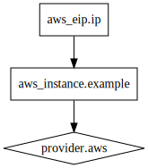

 <!-- .element: class="logo" -->
## Terraform
### Workshop

!SUB

> Terraform is a tool for building, changing, and versioning infrastructure safely and efficiently. &mdash;
> [terraform.io](https://terraform.io)

!SUB
## Key Features
- Infrastructure as Code
- Execution Plans
- Resource Graph
- Change Automation


!SLIDE
## Infrastructure as Code
Infrastructure is described using a high-level configuration syntax. This allows a blueprint of your datacenter to be versioned and treated as you would any other code. Additionally, infrastructure can be shared and re-used.

!SUB
## Define AWS EC2 instance
```
provider "aws" {
    access_key = "ACCESS_KEY_HERE"
    secret_key = "SECRET_KEY_HERE"
    region = "us-east-1"
}

resource "aws_instance" "example" {
    ami = "ami-408c7f28"
    instance_type = "t1.micro"
}
```


!SLIDE
## Execution Plans
Terraform has a "planning" step where it generates an execution plan. The execution plan shows what Terraform will do when you call apply. This lets you avoid any surprises when Terraform manipulates infrastructure.

!SUB
## Creating infrastructure
```
$ terraform plan
...

+ aws_instance.example
    ami:               "" => "ami-408c7f28"
    availability_zone: "" => "<computed>"
    instance_type:     "" => "t1.micro"
    key_name:          "" => "<computed>"
    private_dns:       "" => "<computed>"
    private_ip:        "" => "<computed>"
    public_dns:        "" => "<computed>"
    public_ip:         "" => "<computed>"
    security_groups:   "" => "<computed>"
    subnet_id:         "" => "<computed>"
```

This only shows what will change. Nothing has been created yet...

!SUB
## Applying changes
To apply the plan use the<br>`terraform apply` command

```
$ terraform apply

aws_instance.example: Creating...
  ami:                      "" => "ami-26367151"
  availability_zone:        "" => "<computed>"
  ...

aws_instance.example: Creation complete

Apply complete! Resources: 1 added, 0 changed, 0 destroyed.

The state of your infrastructure has been saved to the path
below. This state is required to modify and destroy your
infrastructure, so keep it safe. To inspect the complete state
use the `terraform show` command.

State path: .terraform/terraform.tfstate
```

!SUB
## Changing existing infrastructure
```
$ terraform plan
...

-/+ aws_instance.example
    ami:               "ami-408c7f28" => "ami-aa7ab6c2" (forces new resource)
    availability_zone: "us-east-1c" => "<computed>"
    key_name:          "" => "<computed>"
    private_dns:       "domU-12-31-39-12-38-AB.compute-1.internal" => "<computed>"
    private_ip:        "10.200.59.89" => "<computed>"
    public_dns:        "ec2-54-81-21-192.compute-1.amazonaws.com" => "<computed>"
    public_ip:         "54.81.21.192" => "<computed>"
    security_groups:   "" => "<computed>"
    subnet_id:         "" => "<computed>"
```

!SUB
## Destroying infrastructure
```
$ terraform plan -destroy
...

- aws_instance.example

$ terraform destroy
Do you really want to destroy?
  Terraform will delete all your managed infrastructure.
  There is no undo. Only 'yes' will be accepted to confirm.

  Enter a value: yes

aws_instance.example: Refreshing state... (ID: i-2f273e85)
aws_instance.example: Destroying...
aws_instance.example: Destruction complete

Apply complete! Resources: 0 added, 0 changed, 1 destroyed.
```

!SUB
## Saving plans
By default, `terraform apply` scans the current directory for the configuration and applies the changes appropriately.

The plan can be saved using `terraform plan -out example.plan`, and then provided to `terraform apply example.plan` to ensure only the pre-planned actions are executed.


!SUB
## Applying sub-plans
Only want to update a subset of your infrastucture?

Plans can also be targetted to specific resources using the `-target=resource` parameter when `plan`-ning or `apply`-ing


!SLIDE
## Resource Graph
Terraform builds a graph of all your resources, and parallelizes the creation and modification of any non-dependent resources. Because of this, Terraform builds infrastructure as efficiently as possible, and operators get insight into dependencies in their infrastructure.

!SUB
## Example: Add elastic IP

```
resource "aws_eip" "ip" {
    instance = "${aws_instance.example.id}"
}
```

!SUB
## Generate plan
```
$ terraform plan
...

+ aws_eip.ip
    allocation_id:     "" => "<computed>"
    association_id:    "" => "<computed>"
    domain:            "" => "<computed>"
    instance:          "" => "i-51a3bcfb"
    network_interface: "" => "<computed>"
    private_ip:        "" => "<computed>"
    public_ip:         "" => "<computed>"


Plan: 1 to add, 1 to change, 0 to destroy.
```

!SUB
## Generate graph
```
$ terraform graph

digraph {
    compound = "true"
    newrank = "true"
    subgraph "root" {
        "[root] aws_eip.ip" [label = "aws_eip.ip", shape = "box"]
        "[root] aws_instance.example" [label = "aws_instance.example", shape = "box"]
        "[root] provider.aws" [label = "provider.aws", shape = "diamond"]
        "[root] aws_eip.ip" -> "[root] aws_instance.example"
        "[root] aws_instance.example" -> "[root] provider.aws"
    }
}
```

Output in dot format, can be viewed with [Graphviz](http://www.graphviz.org).

!SUB
Or convert it to a picture:
```
terraform graph | dot -Tsvg -o example_graph.svg
```

 <!-- .element class="shadow" -->

<small>which means your infrastructure diagrams will always be up-to-date ;-)</small>


!SLIDE
## Change Automation

Goal is to execute complex changesets with minimal human interaction

Execution plans and resource graphs provide insight to enable this
